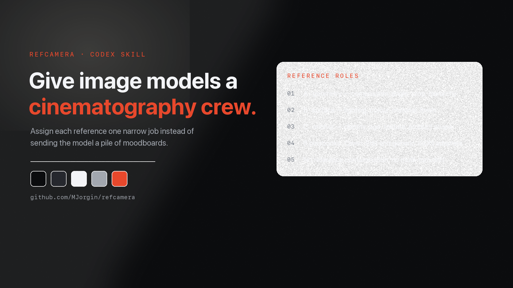

# RefCamera

[**English**](README.md) · **简体中文**



> 给 AI 生图模型配一个摄影组，而不是丢一堆情绪板。

RefCamera 是一个做**角色分工式** AI 生图的 Codex skill。与其把一堆灵感图一股脑丢给模型，
不如给每张参考图派一个明确的活：

- **A —— 几何**：构图、机位角度、裁切、主体比例、画面层级。
- **B —— 表面**：光线、色彩、材质、镜头质感、氛围。
- **C —— 可选锚点**：身份、年龄、肤质／发丝质感、产品形状，或某一种具体材质。

同一套契约可以路由到不同的「支持参考图」的模型。当前附带的工具包含一个 SiliconFlow
Qwen Image Edit 适配器和一个通用 JSON 适配器，并在服务方无法抓取公网图片链接时，
自动把 URL 转成 data URL。

## 为什么要 RefCamera

情绪板式的提示词经常造成**参考污染**：模型把错的那张图里的人脸、衣服、场景、水印或光线
抄了过来。多轮编辑还会漂移：想修个肤质，脸被换掉了；想改个光线，构图被改坏了。

RefCamera 的办法是把参考图的角色和编辑不变量都写清楚：

1. 用 playbook 给任务分类。
2. 给参考图分配 A／B／C 角色。
3. 写一份原创的生成契约。
4. 路由到支持参考图的模型。
5. 从构图、表面真实感、安全性和原创性四个方面复核。
6. 每次只改一个变量，把已经认可的部分锁住。

## 内置 playbook

- 写实人像
- 街拍／纪实抓拍
- 产品与材质研究
- 建筑与室内
- 叙事场景
- 角色一致性
- 海报主视觉构图
- 概念产品拆解

文字密集的 UI、信息图、logo、图标和需要精确复现的图表**不在**适用范围——那些请走
代码原生、矢量、文档或 UI 的工作流。

## 安装

把 skill 复制进你的 Codex skills 目录：

```bash
mkdir -p ~/.codex/skills
cp -R skills/refcamera ~/.codex/skills/refcamera
```

重启 Codex 或重新加载 skill 即可。

## 配置生图

附带脚本除标准库外不需要任何 Python 依赖。

把 SiliconFlow 的 key 放进环境变量或本地密钥文件：

```bash
export SILICONFLOW_API_KEY="your-key"
```

或者写进 `~/.codex/secrets/media-tools.env`：

```ini
SILICONFLOW_API_KEY=your-key
```

这个文件**永远不要**提交到仓库。脚本只在本地读取，也不会把授权头打印出来。

## 快速开始

```bash
python3 ~/.codex/skills/refcamera/scripts/refcamera_generate.py \
  --provider siliconflow-qwen-edit \
  --image-a ./composition-reference.png \
  --image-b ./lighting-reference.jpg \
  --out ./output.png \
  --prompt "$(cat examples/realistic-portrait-contract.md)"
```

换成一个 JSON 字段名不同的模型：

```bash
python3 scripts/refcamera_generate.py \
  --provider generic-json \
  --endpoint "$IMAGE_EDIT_ENDPOINT" \
  --api-key-env MY_IMAGE_KEY \
  --model "$MODEL_ID" \
  --image-a ./a.png \
  --image-b ./b.jpg \
  --image-a-field image \
  --image-b-field style_image \
  --extra-json '{"size":"1024x1536"}' \
  --prompt "..." \
  --out ./output.png
```

完整参数见 `python3 scripts/refcamera_generate.py --help`。

## 参考契约

每次生成都应该写清楚：

- 每张图控制什么；
- 每张图里必须**忽略**什么；
- 原创的主体或场景是什么；
- 文字、logo、水印方面的约束；
- 版权与使用场景；
- 目标画幅比例和出图数量；
- 后续编辑要保持的不变量。

参见 [`examples/realistic-portrait-contract.md`](examples/realistic-portrait-contract.md)。

## 写实人像指引

做写实人物时，在合适的前提下把「成年」写明确，并把年龄／构图与光线／质感分开处理：

- 用 A 锁住取景、视觉年龄、视线方向和面部比例；
- 用 B 定实际光源、场景环境、镜头色调和氛围；
- 当用户已经认可脸或年龄时，把那张定稿作为 C；
- 肤质、发丝和镜头质感单独用一张质感参考；
- 避免校服、儿童化造型、性化姿态，以及年轻人物人像中的裸露。

如果出图一眼假，不要第一反应去重画脸。换掉光线／风格参考，并减少美颜式的过度修饰。

## 版权与隐私

点赞、收藏、转发都不是授权。

- 个人探索可以用更宽的情绪板式调研，但产出仍应避免直接复制；
- 客户、公开或商业用途，应使用自有、已授权、公共领域／兼容 CC，或原创生成的参考图；
- 外部参考图要记录标题、作者、页面链接、直链和许可；
- 不要抓取私密平台、绕过访问控制，也不要自动化那些禁止自动化的服务；
- 把私人照片和可识别人脸当作隐私输入；未经许可不要缓存或公开。

RefCamera 只是工作流辅助，不提供法律意见。

## 仓库结构

```text
skills/refcamera/
  SKILL.md
  agents/openai.yaml
  references/
  scripts/refcamera_generate.py
examples/
LICENSE
```

## 路线图

- 参考图预检：水印、年龄歧义、画幅比例、光线冲突
- 运行清单：提示词、服务方、来源记录、质检备注
- Seedream 适配器与多方案批量出图
- 服务方能力对照表
- 可选的本地摄影质感处理：颗粒、色彩与轻微手持取景
- 更多不涉及可识别真人肖像的合规示例包

## 许可

MIT。见 [`LICENSE`](LICENSE)。
